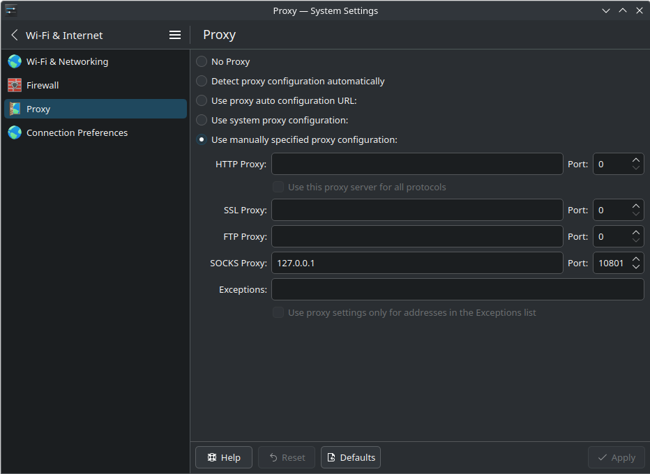

# ByeDPI on Linux

Create shell script:

```sh
#!/bin/bash
ciadpi -i 127.0.0.1 -p 10801 -d 1
```

Create systemd service on `/etc/systemd/system/name.service`:

```ini
[Unit]
Description=ByeDPI
After=graphical-session.target

[Service]
ExecStart=/path/to/script.sh
Restart=always

[Install]
WantedBy=graphical-session.target
```

Start service:

```sh
sudo systemctl enable name.service
sudo systemctl start name.service
```

Enable SOCKS5 proxy:

KDE NetworkManager:



nmcli:

```sh
sudo nmcli connection modify <connection_name> proxy.method manual
sudo nmcli connection modify <connection_name> proxy.socks 127.0.0.1
sudo nmcli connection modify <connection_name> proxy.socks-port 1080
```
