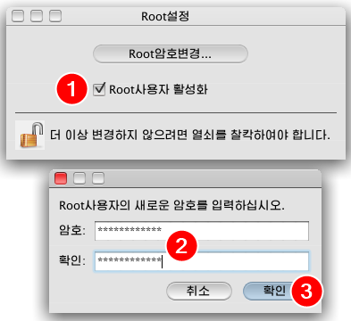

# Notes on Red Star OS 3.0

Taken from <https://richardg867.wordpress.com/2015/01/01/notes-on-red-star-os-3-0/> and <https://richardg867.wordpress.com/2020/03/31/more-notes-on-red-star-os-3-0/>

## Part 1

The latest version of North Korea’s custom Linux distribution, Red Star OS – that one with the Mac OS X style interface – has [leaked onto the internet](http://pastebin.com/cHAzyTE7). While [the individual who talked about technology in North Korea at the 31C3 conference](http://media.ccc.de/browse/congress/2014/31c3_-_6253_-_en_-_saal_2_-_201412292115_-_computer_science_in_the_dprk_-_will_scott.html) claimed he didn’t see anybody using Red Star seriously, it’s still an interesting distribution to check out.


### Installation

The Korean installer is quite easy to go through blind. All you need to watch out for is the network configuration, which is not set to DHCP by default. Some extras, including compilers and a LAMP stack, are available through the Customize screen. The installer – a customized version of Fedora’s Anaconda – can be started in English by two different methods:

**Method 1:** As soon as your machine starts booting from the Red Star installation media – for example, right after pressing Enter on the BIOS boot menu – keep pressing Esc repeatedly for a few seconds. You’ll be stuck on a screen with nothing but a blinking cursor. Type the following command line (which won’t appear on the screen) and press Enter: `linux lang=en`

**Method 2:** Modifying the ISO file. In `/isolinux/isolinux.cfg`, replace `lang=ko` with `lang=en` on the kernel parameters.

Some minor parts of the UI remain untranslated as they are static images. The installed system will still be in Korean, but we’ll fix that later.


### Obtaining root access

Just like OS X, the root user is disabled by default and the system provides an utility to enable it, however getting to said utility through the Korean user interface is a challenge. Luckily, it can be executed from a terminal, which is relatively easy to get to:

1. Click the Applications folder on the dock
2. Click the plain folder (called “AppLink” in English)
3. Click the Utilities folder with a hammer and wrench icon (on a full install, there will be another folder with a hammer icon, which is not the one you should click)
4. Click the Terminal icon


Run the rootsetting command to open the root utility. Click the padlock to unlock the settings, enter your password and click the blue button.


Check the checkbox. You’ll be prompted to enter and confirm a password for the root user. Type the password into both boxes and click the blue button. The root user is now enabled; the utility can be closed.



My old rootsh RPM – which takes advantage of the unprivileged package installer – is still available [here](https://mega.nz/#!jgBT0RxZ!LQDEBBrbGxE6fag4d_A2C2cWj2PSNR_ZvnSW_UjRD5E) for reference.

### English

Like the installer, the system can run in English, and the included apps have English translations as well. After enabling root access through a terminal as described above, run the su command to log in as root, then run the following command to change the language (thanks [davidiwharper on OSNews](http://www.osnews.com/permalink?602834)):

```sh
sed -i 's/ko_KP/en_US/g' /etc/sysconfig/i18n /usr/share/config/kdeglobals
```

Reboot the system (through the menus or by running the reboot command) to apply the changes. These steps are reported to work on Red Star 2.5 Server as well, with the difference that su is not required since you’re already logged in as root.


### Internet connectivity

For some reason, Red Star’s iptables firewall is set to only allow outgoing connections to certain ports. DNS is blocked as North Korea’s intranet uses IP addresses only, so you can’t get a proper internet connection on Red Star by default. To fix that, run the following commands as root to clear Red Star’s default firewall rules:

```sh
rm /etc/sysconfig/iptables
service iptables restart
```

The included “Naenara Browser” is Firefox 3.5 with a custom skin and a Korean language pack. Its language can be changed to English by disabling the language pack (thanks Chocohead):

1. Go to the second-to-last menu
2. Select the third option
3. Go to the second-to-last tab
4. Select the “(ko-KP)” add-on and click the first button to disable it
5. Click the button on the yellow bar to restart the browser
6. The browser will ask for confirmation if more than one tab is open, click the blue button if it does


Despite the browser being configured to browse on the North Korean intranet, it works on the internet (about as well as Firefox 3.5 does these days) once you apply the iptables fix above.


### Dubious components

As highlighted on the [32C3 follow-up talk](https://media.ccc.de/v/32c3-7174-lifting_the_fog_on_red_star_os), Red Star contains several shady components, including but not limited to a file watermarking system service and a supposed “virus scanner”. The speakers [provided instructions](https://github.com/takeshixx/redstar-tools/blob/master/README.md) on how to disable these components.

### Other notes

* This version of Red Star was released no sooner than June 2013, according to file dates.
* There appears to be a system file modification detector, which warns about modified system files when you log in. It might warn you about the kernel and initramfs images in some configurations. To disable it, run this command as root to remove its autorun entry:

```sh
rm /usr/share/autostart/intcheck_kde.desktop
```

* The 32C3 talk also mentions a similar service which automatically reboots the system if files related to the aforementioned malicious components are modified.
* The disc includes a Windows executable named `install.exe`, which displays a window with two buttons. The leftmost one displays an error message, presumably telling you to boot from the DVD, and the rightmost one closes the window. The windows consist of static images stored in the EXE’s Bitmap resources, and strangely there are a few more of them – it remains to be seen what are they for.


* Press Esc on the boot splash for verbose boot.
* English or South Korean locales were replaced to accommodate the new North Korean locales throughout the system.
* The English translation is surprisingly good. One theory is that all English text was taken straight out of OS X.
* The “Crosswin” Windows compatibility layer is a wrapper around Wine 1.2.2.

## Part 2

Five years ago, I wrote [a post on Red Star OS 3.0](https://richardg867.wordpress.com/2015/01/01/notes-on-red-star-os-3-0/), the latest version of North Korea’s home-grown Linux distribution to make its way outside of the country’s walled garden. That post was one of the internet’s first guides on exploring this peculiar distro, so it gathered way more attention than I would ever expect. I’m now back with additional, more specific notes on Red Star’s built-in applications.

### Installing from Windows

It turns out there is more to the `install.exe` Windows executable located in the installation disc. According to a comment in the previous post – as well as Google Translate – the error message displayed by that executable tells you to copy the installation files to your hard drive. Once I copied the DVD’s file structure to the Documents folder and ran `install.exe` from there, the error message changed to a confirmation request, which apparently asks if I want to reboot to continue.


Clicking the blue button reboots the system to reveal a new “RedStar Setup” entry on the Windows boot menu, set to start automatically after 1 second. That boot entry is automatically removed by the installer once it is up and running.


The installer pulls this off by copying a few boot files to the root of the Windows partition, then registering `\RS\rsloader.mbr` as a real-mode boot option – often used to chainload into other bootloaders – on Windows’ BCD (Boot Configuration Data); `\RS\BCD` is presumably a backup of the previous BCD. This is not an unseen tactic, as a few Linux distributions have also shipped Windows-based installation kickstarters in the past, which also leverage the Windows boot manager to start the Linux-based installer without asking the user to fiddle around with BIOS settings and boot menus.


Starting the installer in English is still possible by hammering the E key as soon as the Windows boot menu screen disappears. This will force the Grub bootloader to enter its command line editor. Add `lang=en` to the end, press Enter to save and B to boot.


Another method is breaking out of the automatic boot (hammer any arrow key on the boot menu), booting into Windows and editing `\m_rs.lst` with a text editor which can handle UNIX line endings, such as WordPad or Windows 10’s Notepad. Run the editor as administrator, open that file, replace `lang=ko` with `lang=en` on the kernel parameters, and save. It’s also worth noting the additional parameters used by the installer to find itself:

* `RS3URL=` points to the installation files’ location within the Windows partition;
* `BOOTUUID=` points to the Windows partition by its volume serial number;
* `BOOTMGRUUID=` points to the partition containing the Windows boot manager, which is usually the hidden System Reserved partition if your system has one.


The installer’s disk utility refuses to alter the Windows partition containing the installation files in any way. You must leave some unallocated space or a partition for Red Star prior to booting the installer, or install to a different drive.


As with other Linux distributions, the installer adds a second boot menu entry which chainloads into the Windows boot manager.


### Sogwang Office

The Sogwang Office suite is a fork of OpenOffice.org 3.0 with a North Korean language pack. The option to change the interface language was removed, but the English language pack is still present. Run the following commands as root to remove part of the Korean language pack, forcing all suite applications to load English text instead:

```sh
cd /Applications/SGOffice.app/Contents
rm RedStar/resource/*ko.res share/registry/Langpack-ko.xcd
```

It might be possible to change the language by editing configuration files, however, I couldn’t figure out where the language preference is stored within OpenOffice’s rather complex configuration system. Leave a comment if you happen to know something about OpenOffice’s internals.


### Crosswin

The Crosswin compatibility layer is a wrapper around Wine 1.2.2, consisting of a helper application and some Korean-only documentation. It’s an optional component which can be selected on the installer’s Customize window, though it appears you can install optional components after the fact by opening the Software Manager application, selecting the only entry on the list, clicking Modify and selecting the components to install (double-click expands the categories).

Once installed, Crosswin can be reached through the Applications > AppLink > [Korean text] 3.0 menu. The “Install” application provides a few presets for installing common software – apparently just Photoshop, which the North Koreans would have totally legitimate copies of – as well as an Add/Remove Programs interface, a shortcut to `winecfg` and a font installer.


I’ve attempted to install Photoshop CS2 using the preset, but it didn’t work. After clicking Install, the application asks for some executable, which I assume to be Setup.exe on the Adobe CS2 disc. Selecting it starts the installer, which displays a splash screen for a few moments, closes itself, then the application claims Photoshop was successfully installed, which it clearly wasn’t.


Crosswin can also be invoked by opening .exe files from the file manager. The screenshot below shows a few old Windows XP applications which I’ve opened directly from another drive. Paint doesn’t let you type in text, the Calculator is braindead, and 3D Pinball (minimized) is unplayable due to the plunger and flippers not actuating. The only 3rd-party application on that drive was the PC version of Sonic & Knuckles, which runs fine but with no music due to the lack of a MIDI synthesizer.


### APM

The LAMP stack, oddly named APM – which definitely stands for Apache, PHP, MySQL – is yet another optional component. When installed, it adds a little menu bar gadget allowing you to control the stack’s services. The menu is produced by the APM Manager application, one of the system’s numerous fully custom applications which were never translated to English.

The stack provides a Webmin management interface on <http://localhost:10000> – selecting the last option on the aforementioned menu will open that URL on Naenara Browser. Run the following commands as root to change Webmin’s language to English:

```sh
sed -i 's/ko_KP.UTF-8/en/g' /etc/sat/config /usr/share/sat/web-lib.pl
service sat restart
```

Refresh the page to apply. Log in as root with the password you set when enabling root access.


The Webmin install (located on `/usr/share/sat`) is pretty barebones, containing just the Apache Webserver, MySQL Database Server, PHP Configuration and Webmin Users modules. None of the modules Webmin provides for managing itself or the system as a whole are present. For what it’s worth, the limited selection of modules reduces the attack surface – Webmin’s system management modules have faced many [CVEs](https://www.cvedetails.com/vulnerability-list/vendor_id-358/product_id-612/Webmin-Webmin.html) over the years – but iptables on Red Star is configured to block all incoming connections from outside the machine by default anyway.


### /Applications

Red Star mimics the OS X .app bundle format for its applications. The executables themselves are inside `Contents/RedStar`, and the name, icon and executable path are determined by `Contents/info.desktop`, a standard KDE `.desktop` file. Some apps like Sogwang Office and GIMP are contained entirely within the bundle. They didn’t go very far with mimicking the OS X filesystem structure, though; `/System/Library` is a symlink to `/usr/share` and that’s about it.

Here are all the other applications I haven’t covered:

* **Address Book**, **Calculator**, **Font Book**, **Grab**, **kCal** (Calendar), **kPhoto** (iPhoto), **Preview**, **QuickTime Player**, **Stickies** and **System Preferences** (internally named `kcontrol`) are custom-designed clones of their OS X counterparts. Preview hides a copyright string in the executable: “(C) 2009-2012, KCC CHONGBONG CENTER”. QuickTime Player was developed using GTK instead of Qt for some reason.
* **CD/DVD Writer** is K3B, complete with the old Crystal icons from KDE 3. There’s also an OS X Automator icon hiding in the Preferences window.
* **CHMViewer** is literally kchmviewer.
* **compress** is an archiver made to look a bit like WinZip.
* **GIMP**, internally named `Hwansang.app`, is GIMP 2.4 with a custom splash screen.
* **Kooka** has a poor English translation despite it being a KDE app for some reason, judging by the “Device is not connected or you don’t select” error message if no scanner is found.
* **Mail** loosely follows OS X’s Mail.
* **PDFEditor** hides yet another copyright string in the executable: “(C) 2009-2014 KCC  INTELLIGENCE INFORMATION RESEARCHER”
* **PhotoBooth** is Cheese.
* **Ryugyong Janggi** is a janggi (Korean chess) game, yet another custom job without an English translation.
* **Simple Text** is a clone of… SimpleText from the Classic Mac OS? That’s one big throwback.
* **SWF Player** is Gnash, specifically `qt4-gnash`.
* **Software Manager** allows for installing optional components from the installation media, as mentioned in the Crosswin section. There’s also a system updater, which is not configured by default, though it would presumably download updates through the North Korean intranet. Its executable hides the incredibly useful copyright string “(C) 2008 djh”.
* **UnBangUI** is a musical score composer, also missing an English translation. A Windows version might exist, given how the toolbar icons are Windows-like and the application itself is developed using wxWidgets. It includes a handful of sample songs demonstrated in the video below. At least 3 of those appear to be Richard Clayderman compositions according to YouTube’s copyright flag system; leave a comment if you know anything about the other ones.

[Red Star OS UnBangUI sample songs](https://www.youtube.com/watch?v=TvMyklpTLWM)

In the Utilities folder:

* **Activity Monitor**, **Disk Utility**, **Key Store** (Keychain Access), **Network Utility** and **System Profiler** continue the trend of custom-designed applications that clone their OS X counterparts. Activity Monitor and Disk Utility hide a copyright string: “(c) 2009 Osandok Information Center”. System Profiler hides another string: “(C) 2012 mhi”.
* **Bokem** is a file and disk encryption utility, demonstrated on the [31C3](http://media.ccc.de/browse/congress/2014/31c3_-_6253_-_en_-_saal_2_-_201412292115_-_computer_science_in_the_dprk_-_will_scott.html#t=705) talk starting at 11:45.
* **RSLogBrowser** loosely follows OS X’s Console.

In the AppLink Development folder:

* **Companero** is the Eclipse IDE. It comes with Java support for the built-in OpenJDK 1.6.0_17 and there is no Install New Software option for installing plugins.
* **KDbg**, **MySQL Query Browser**, **Qt4 Assistant** and **Qt4 Designer** are exactly what you’d expect, though it appears MySQL Query Browser had its English translation removed.
* **SamTaeSong 3.0 IDE** is KDevelop, including KDevelop Assistant (STS Assistant) and KDevDesigner (STS Designer).

### Further developments

Red Star 4.0 Server was [released](https://kcnawatch.org/wp-content/uploads/sites/5/2019/01/Pyongyang-Times-2019-01-12.pdf) (page 6) around January 2019, reportedly featuring UEFI support and improved server management tools. It has not leaked yet as of writing.
