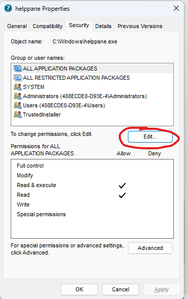

# Disable F1 hotkey

1. Navigate `C:\Windows`
2. Click the Properties to file `helppane.exe`
3. Go to Security tab
4. Click `Advanced` button.

5. Click to `Change` where it says Owner:

6. Enter the object name to select: "your username"

7. Click OK and OK
8. Click `Edit` button

9. Check the box "Full control"

10. Click OK, yes and OK
11. Rename this file
